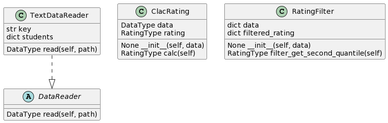

# Лабораторная 1 по дисциплине "Технологии программирования"
Цели работы:
1. Познакомиться c распределенной системой контроля версий кода Git и ее функциями;
2. Познакомиться с понятиями «непрерывная интеграция» (CI) и «непрерывное развертывание» 
(CD), определить их место в современной разработке программного обеспечения;
3. Получить навыки разработки ООП-программ и написания модульных тестов к ним на 
современных языках программирования;
4. Получить навыки работы с системой Git для хранения и управления версиями ПО;
5. Получить навыки управления автоматизированным тестированием программного обеспечения, 
расположенного в системе Git, с помощью инструмента GitHub Actions.

## Индивидуальный вариант - 8
Формат файла - YAML:

Определить и вывести на экран всех студентов, чей рейтинг попадает во вторую квартиль распределения по рейтингам.

## Диаграмма классов

## Структура проекта
- .github/workflows - хранит github actions
- data - хранит в себе данные для обработки в формате .yaml
- src/CalcRating.py - содержит класс с логикой расчёта
- src/DataReader - содержит базовый абстрактный класс для обработки данных из файлов
- src/TextDataReader - содержит класс для обработки данных из файлов формата .yaml
- test/test_CalcRating.py - содержит класс для тестирования логики расчёта
- test/test_DataReader - содержит базовый абстрактный класс для тестирования обработки данных из файлов
- test/test_TextDataReader - содержит класс для тестирования обработки данных из файлов формата .yaml
- requirements.txt - файл с необходимыми библотеками для работы проекта

## Выводы по работе:
В этой лабораторной работе я познакомился с распределенной системой контроля версий кода Git и ее функциями, с понятиями «непрерывная интеграция» (CI) и «непрерывное развертывание», получил навыки написания модульных тестов и навыки управления автоматизированным тестированием программного обеспечения, 
расположенного в системе Git, с помощью инструмента GitHub Actions